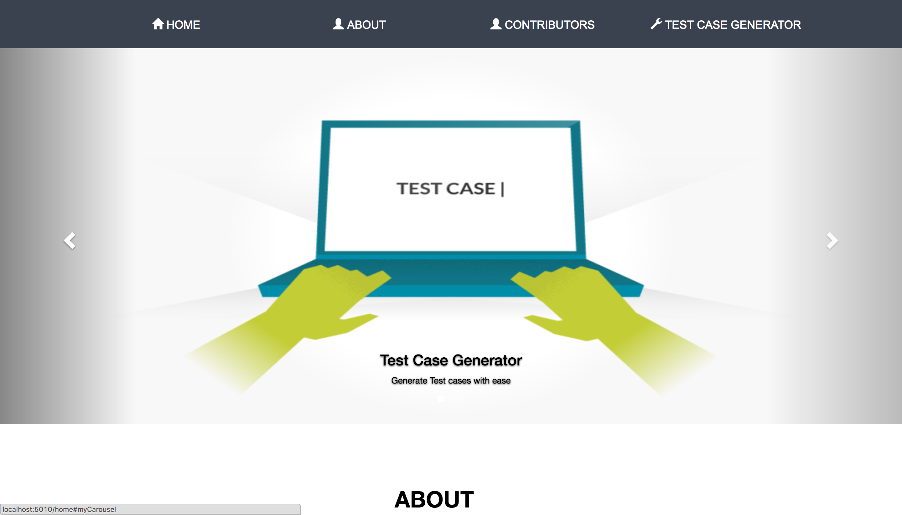
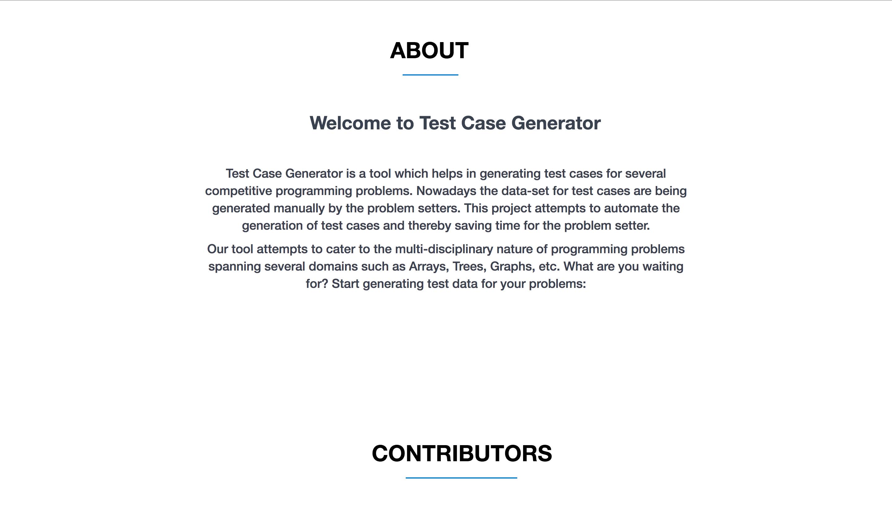
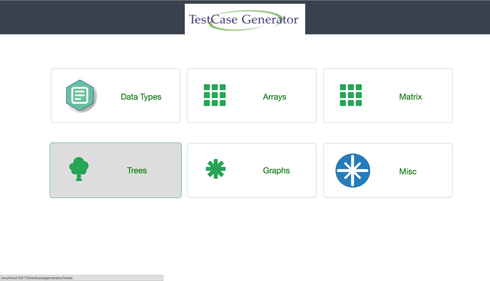
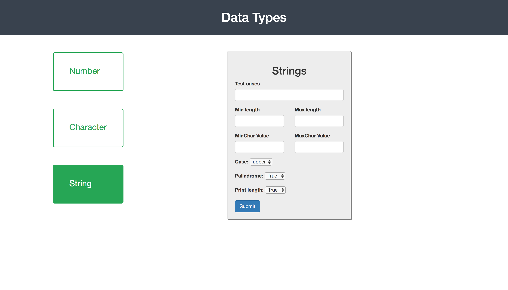

# Test-Case-Generator
Test Case Generator is a tool which helps in generating test cases for several competitive programming problems. Nowadays the data-set for test cases are being generated manually by the problem setters. This project attempts to automate the generation of test cases and thereby saving time for the problem setter. This is our Final-Year Major-Project.

<h2>Features</h2>
<ul>
  <li>Generate test data for basic data types</li>
  <li>Generate test data for arrays</li>
  <li>Generate test data for matrices</li>
  <li>Generate test data for trees</li>
  <li>Generate test data for graphs</li>
</ul>

<h2>Running the Project</h2>

You can run this project in Spring STS or any other IDE of your choice. This procedure gives a detailed step-by-step guide to start running the project in Spring STS. You can download Spring STS <a href="https://spring.io/tools/sts/all">here</a>.

<ul>
  <li>Open Spring STS and clone this project to your local machine</li>
  <li>Navigate to <i>File > Import > Maven > Existing Maven Project</i>. Now browse to the directory in which you have cloned this repo and select it.</li>
  <li>This application is configured to run on port 5010. Make sure you do not have any application running on port 5010 on your local machine.</li>
  <li>If you would like to change the port on which this application runs, then navigate to the file <i>src/main/resources/application.properties</i> and change the <i>server.port</i> property to the port of your choice.</li>
  <li>In order to run the application, go the file <i>src/main/java/com/jntu/TestCaseGeneratorApplication.java</i> and <i>Right Click > Run As > Java Application</i></li>
  <li>Open up your favorite browser and access this application at <a href="http://localhost:5010/">localhost:5010</a> (Note: If you have changed the port on which the application runs, then change it here too!)</li>
  <li>There <i>'might'</i> be few cross-browser issues since this application has been tested only on Chrome.</li>
  <li>Explore the application (Most of it is self explanatory) and start generating the test data for your problems.</li>
</ul>

If you find any problem deploying the project in your machine, please do let us know.

<h2>Development</h2>
<ul>
  <li>Spring STS has been used to code the entire application</li>
  <li>The back-end is written entirely in Java (Spring-Boot Microservices)</li>
  <li>The front-end is written in basic HTML/CSS and JS too. jQuery and Bootstrap frameworks have also been used</li>
  <li>Almost every file is descriptive in nature. Comments provide in-depth explanation about what's going on</li>
  <li>Good, if not best, coding standards have been followed in developing the project. For instance, constants used in the project have been all accumulated in a single file.</li>
</ul>

<h2>Screenshots</h2>

<h4>Home Page</h4>
 

<h4>About Page</h4>
 

<h4>Contributors Page</h4>
 

<h4>Test Case Generator Page</h4>
 

<h4>Form Page</h4>
 

 

<h2>Project documents</h2>
<ul>
  <li>The project abstract</li>
  <li>The project report</li>
</ul>

<h2>Examples</h2>

Enough of test data! What does test data for competitive-programming-problems means? What does this tool serve?
  
Consider that you are a problem setter on a competitive-programming-platform, <a href="https://www.hackerrank.com">Hackerrank</a>.
You want to set a problem similar to <a href="https://www.hackerrank.com/challenges/reduced-string">this</a>.
You spend your entire time creating the problem statement and then writing an efficient solution (since you do not want each and every brute-force solution to pass). Once these are ready, you should generate test data on which your code runs; .i.e., instead of giving small data sets as input, you give huge amount of data in the form of a file (let us call it <i>input.txt</i>) to your program. You record the results (Assuming your logic to be correct).
The result of your problem after running on huge amount of test data will be dumped into a file (let us call it <i>output.txt</i>).
  
Note: A sample <i>input.txt</i> files looks like <a href="SampleTestDataFile.txt">this</a>.
  
Now you submit your files, <i>input.txt</i> and <i>output.txt</i> files to Hackerrank (or any other platform of your choice, on which you would set your problem). Now the platform run's the user's code on <i>input.txt</i> and generates an intermediate file and validates it against <i>output.txt</i> file. If the validation turns out to be true and the user's code runs in a limited amount of time, the platform accepts the user's solution, else it rejects with an appropriate message (either time-out or wrong-answer).
  
All of this seems to be well and good. The only area which is inefficient and time consuming is generating the <i>input.txt</i> file, which constitues the test data pertaining to your problem statement. Ideally the problem setter writes code to generate this <i>input.txt</i> file. This is not at all what the problem setter's intention was. He/She must be responsible for creating the problem statement and coming up with an efficient solution. Generating test-data should be automated. <b>Our tool comes to the rescue here.</b>

<h2>Scope of the Project</h2>
There are several features which can be incorporated into this application.
<ul>
  <li>This application relies heavily on RandomNumberGenerator class. Currently the generator uses <a href="https://docs.oracle.com/javase/7/docs/api/java/util/concurrent/ThreadLocalRandom.html">ThreadLocalRandom</a> class present in the Java SE Library for its implementation. We can customize the underlying implementation class to an efficient and pure-random number generator (with Uniform Distribution).</li>
  <li>Test data for programming problems which involve: finding a path in a matrix, path in a graph, etc are not yet implemented. Basically, we can incorporate several categories into the tool to make it as generic as possible than it is now.</li>
  <li>From the coding point of view, we can still reduce the redundant usage of code and make it efficient.</li>
  <li>The UI can be improved to make the errors even more descriptive.</li>
  <li>The project can be integrated to several competitive-programming-platforms such as <a href="https://www.codechef.com">Codechef</a>, <a href="https://www.hackerrank.com">Hackerrank</a>, <a href="https://www.topcoder.com">TopCoder</a>, etc. Rather than using UI to make requests to back-end service(which is a RESTful service), it can be consumed by any third-party-application which is capable of making HTTP requests.</li>
</ul>

Use this, report bugs, raise issues and Have fun. Do whatever you want! We would love to hear your feedback :)

~ Happy Coding
